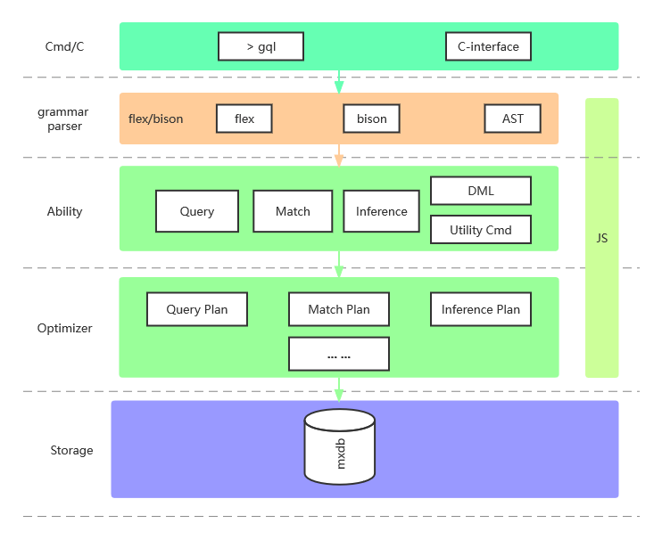

<div align="center">
<h1>GQLite</h1>
</div> 

[](https://gitter.im/webbery/gqlite?utm_source=badge&utm_medium=badge&utm_campaign=pr-badge&utm_content=badge)
<a href="https://github.com/webbery/gqlite/actions">

</a>
<a href="https://codecov.io/gh/webbery/gqlite">
  
</a>

This is the expriments for testing abilities of graph database in ending device.  

<!-- vscode-markdown-toc -->
* 1. [Designed](#Designed)
* 2. [Build](#Build)
	* 2.1. [ubuntu](#ubuntu)
	* 2.2. [macos](#macos)
	* 2.3. [windows](#windows)
	* 2.4. [android](#android)
* 3. [How to use in C/C++](#HowtouseinCC)
* 4. [Graph Query Language](#GraphQueryLanguage)
	* 4.1. [Create Graph](#CreateGraph)
	* 4.2. [Data Types](#DataTypes)
	* 4.3. [Add Vertex & Edge](#AddVertexEdge)
	* 4.4. [Remove Vertex & Edge](#RemoveVertexEdge)
	* 4.5. [Query](#Query)
		* 4.5.1. [intrinct function](#intrinctfunction)
		* 4.5.2. [condition](#condition)

<!-- vscode-markdown-toc-config
	numbering=true
	autoSave=true
	/vscode-markdown-toc-config -->
<!-- /vscode-markdown-toc -->
##  1. <a name='Designed'></a>Designed
In order to get more inflexibility, we try to implement graph database on this paper: GRAD: On Graph Database Modeling. But not strict.  
Here is GQlite's framework:  


##  2. <a name='Build'></a>Build
Use command with `git clone --recursive https://github.com/webbery/gqlite.git` to clone this repository.
###  2.1. <a name='ubuntu'></a>ubuntu  
Install latest version of bison.  
###  2.2. <a name='macos'></a>macos  
Install latest version of bison.  
###  2.3. <a name='windows'></a>windows  
An version of flex&bison is placed in dir `tool`. So it's not need to install dependency.  
###  2.4. <a name='android'></a>android  
C++: 17  
Please use cross-compile tools on Ubuntu/MacOS. Some mistakes of libzstd occur on Windows.  
##  3. <a name='HowtouseinCC'></a>How to use in C/C++  
An simple example shows how to use in your program is here:  
```
#include "gqlite.h"

int gqlite_exec_callback(gqlite_result* params)
{
  if (params) {
    switch (params->type)
    {
    case gqlite_result_type_node:
    {
      gqlite_node* node = params->nodes;
      while (node) {
        switch (node->_type)
        {
        case gqlite_node_type_vertex:
        {
          gqlite_vertex* v = node->_vertex;
          if (v->type == gqlite_id_type::integer) {
            printf("[%d, %s]\n", v->uid, v->properties);
          }
          else {
            printf("[%s, %s]\n", v->cid, v->properties);
          }
        }
          break;
        case gqlite_node_type_edge:
          break;
        default:
          break;
        }
        node = node->_next;
      }
    }
      break;
    case gqlite_result_type_cmd:
      for (size_t idx = 0; idx < params->count; ++idx) {
        printf("%s\n", params->infos[idx]);
      }
      break;
    default:
      break;
    }
  }
  return 0;
}

int main() {
  gqlite* pHandle = 0;
  gqlite_open(&pHandle);
  char* ptr = nullptr;
  gqlite_exec(pHandle,
    "{create: 'example_db'}",
    gqlite_exec_callback, nullptr, &ptr);
  gqlite_free(ptr);
  gqlite_close(pHandle);
}
```
##  4. <a name='GraphQueryLanguage'></a>Graph Query Language
###  4.1. <a name='CreateGraph'></a>Create Graph
Create a graph is simply use `create` keyword. The keyword of `group`, means that all entity node which group belongs to. If we want to search vertex by some property, `index` keyword will regist it.
```javascript
{
    create: 'movielens',
    group: [
        {movie: ['title', 'genres']},
        {tag: ['user_id', 'tag', 'movie_id']},  // <-- relationship's property must write center if it is a edge
        {rate: ['user_id', 'rate', 'movie_id']}
    ],
    index: 'tag',
}
```
Here we create an index called `tag`. The `tag` will create revert index from `tag` to group `tag`'s id. Following create a index pair with key and value:
```javascript
{
    create: 'movielens',
    group: [
        {movie: ['title', 'genres']},
        {tag: ['user_id', 'movie_id', 'tag']},
        {rate: ['user_id', 'movie_id', 'rate']}
    ],
    index: {tag: 'movie_id'},       // <-- index pair
}
```
So after upset a new tag, the revert index will be added.
###  4.2. <a name='DataTypes'></a>Data Types
Normaly, basic data type as follows:  
    **string**: 'string'  
    **number**: 10 means integer, 10.0 means real number.   
    **array**: start as `[` and end with `]`  
    **binary**:  start with `0b`, then follow as base64 string, it will save as binary data. Such as `0b'df32099'`  
    **datetime**: start with `0d`, then will try to convert following string to datetime, such as `0d1642262159`  
    **vector**: a special type of array, which items are same type.  
    **hash**: a special type of string, start with `0h` like `0h'hash'`  
###  4.3. <a name='AddVertexEdge'></a>Add Vertex & Edge
add or update vertex:
```javascript
{
    upset: 'movie',
    vertex:[
        [21, {'title': 'Get Shorty', genres: ['Comedy', 'Crime', 'Thriller']}],
        [53, {title: 'Lamerica (1994)', genres: ['Adventure','Drama']}],
        [88, {title: 'Black Sheep (1996)'}]
    ]
}
```
Note that current graph is created graph before called `movielens`. The 3 of vertexes is added to group `movie`.    

add or update edge:
```javascript
{
    upset: 'tag',
    edge: [
        [{user_id: 2}, {'--': 'Martin Scorsese'}, {movie_id: [106782, 89774]}],
        [{user_id: 21}, {'--': ['romantic comedy', 'wedding']}, {movie_id: 1569}],
    ]
}
```
For simply use, it can be write as follows, but id is automatic generated by database:
```javascript
{
    upset: 'edge',
    edge: [
        ['Tom', ->, 'Lamerica'],
        ['Kitty', <-, 'Black Sheep'],
    ]
}
```
or simply use bidirection:
```javascript
{
    upset: 'tag',
    edge: [
        ['Tom', --, 'Lamerica'],
        ['Kitty', --, 'Black Sheep'],
    ]
}
```
###  4.4. <a name='RemoveVertexEdge'></a>Remove Vertex & Edge
```javascript
{remove: 'graph', vertex: [21, 88]}
```
###  4.5. <a name='Query'></a>Query

####  4.5.1. <a name='intrinctfunction'></a>intrinct function
##### count()
```javascript
{// this is used to count the number of vertex
    query: count(vertex),
    group: 'movie'
}
```
####  4.5.2. <a name='condition'></a>condition
query all movie that has tag:
```javascript
{
    query: [movie.title, movie.genres],
    where: [
        [user_id, {--: *}, movie_id]        // here is an edge condition, user_id and movie_id are in group `tag`, * represent all relationship here.
    ],
    in: 'movielens' // the graph instance can be written here or not.
}
```
<!-- ```javascript
{
    query: [movie, tag],
    where: [
        [user_id, {--: 'wedding'}, movie_id]
    ],
    in: 'graph'
}
``` -->
Or:
```javascript
{
    query: movie,
    where: {tag: ['black comedy']}
}
```
query points from graph by relationship:
```javascript
{
    query: user,
    where: {
        ->: 'son'
    }
}
```
```javascript
{
    query: user,
    where: [
        {
            user: function(user) { return user.age > 10}
        }
    ],
}
```
query a list of neighbors, where `1` mean 1'st neighbors:
```javascript
{query: user, from: 'v1', where: {--: 1}}
```
In order to get a search way
```javascript

```
###  4.6. <a name='Inference'></a>Inference
Here we define a kind of inference operator, and apply it to a graph.  
HMM:
```javascript
{
    query: hidden_variant,
    event: [{e1: 'sun'}, {e2: 'rain'}, {e3: 'wind'}],
    where: [
        [hidden_variant.v1, {->: 0.2}, e1],
        [hidden_variant.v2, {->: gassian(0.2, 0.1)}, e2],
        [hidden_variant.v3, {->: gassian(0.2, 0.1)}, e3],
        [hidden_variant.v1, {->: 0.2}, hidden_variant.v2],
        [hidden_variant.v2, {->: 0.2}, hidden_variant.v3],
        [hidden_variant.v1, {->: 0.2}, hidden_variant.v4],
    ]
}
```
###  4.7. <a name='CeateJob'></a>Ceate Job
###  4.8. <a name='Transition'></a>Transition
##  5. <a name='Utility'></a>Utility
###  5.1. <a name='ShowGraphs'></a>Show Graphs
```
show graph
show graph 'xxx'
```
### Use Graph
```
use graph 'xxx'
```

## Papers  
1. Yihan Sun, Daniel Ferizovic, Guy E. Belloch. PAM: Parallel Augmented Maps.  
2. Laxman Dhulipala, Guy Blelloch, Yan Gu, Yihan Sun. PaC-trees: Supporting Parallel and Compressed Purely-Functional Collections.  
3. Amine Ghrab, Oscar Romero, Sabri Skhiri etc. GRAD: On Graph Database Modeling.  
4. [向量索引算法HNSW和NSG的比较](https://zhuanlan.zhihu.com/p/105594786)  