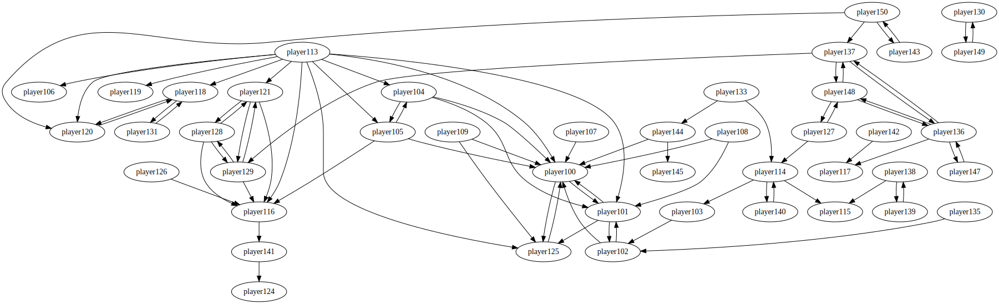

<!-- vscode-markdown-toc -->
* 1. [About Test](#AboutTest)
	* 1.1. [basketballplayer test](#basketballplayertest)
	* 1.2. [regress test](#regresstest)

<!-- vscode-markdown-toc-config
	numbering=true
	autoSave=true
	/vscode-markdown-toc-config -->
<!-- /vscode-markdown-toc -->

##  1. <a name='AboutTest'></a>About Test

###  1.1. <a name='basketballplayertest'></a>basketballplayer test  
this dataset contain players infomation and their relation, which `follow` graph looks like as following:  

It origin from https://github.com/vesoft-inc/nebula-docs/blob/master/docs-2.0/basketballplayer-2.X.ngql.  

This picture is generate from `gql` command tool. Try following command then you will get the `dot` format output in console:
```bash
$ your_place_of_gql basketballplayer  # basketballplayer is the database instance in your disk
# then you will into gql console
GQLite Version 0.1.0
Writting by Webberg.

MIT License. Build: 819a9caa78097b9084ad118eb3cf7fe3ad9c2d24
gqlite> dot on # this command will change graph output to `dot` format
gqlite> {query: 'follow', in: 'basketballplayer'}; # this query will show `follow` graph with 'dot` format output
...
gqlite> dot off # this command will change output info with normal format
gqlite> .exit # this will exit gql console
```

###  1.2. <a name='regresstest'></a>regress test
